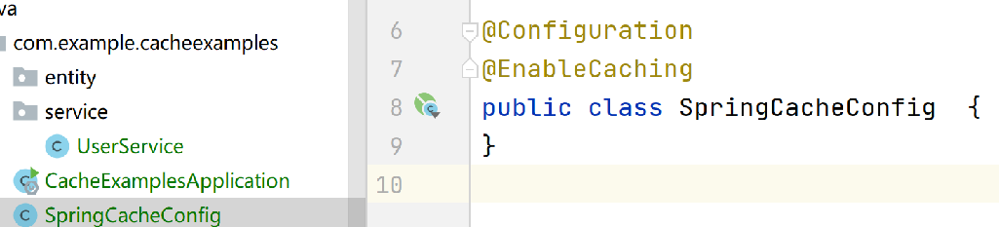
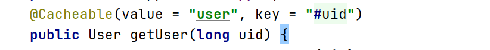
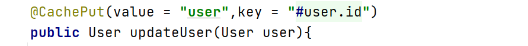
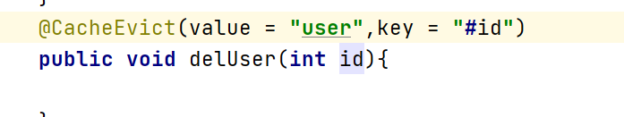
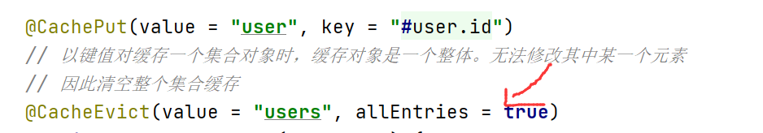
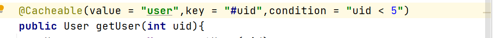
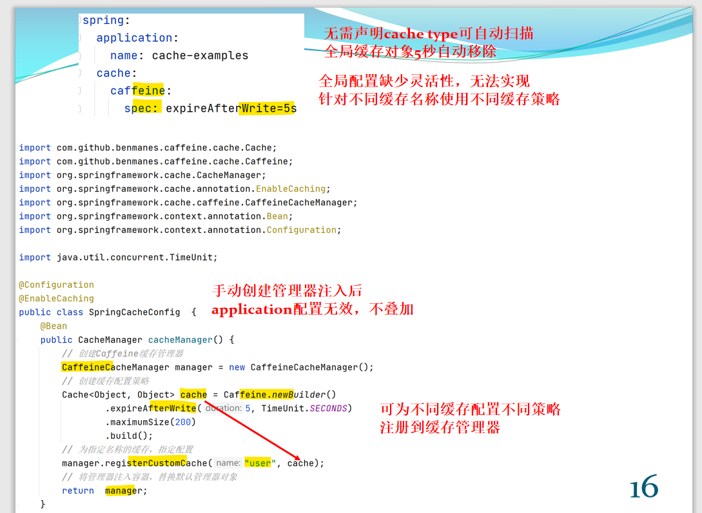

# Cache

* Spring将缓存应用于方法，从而根据缓存中可用信息减少方法执行次数
* 每次调用目标方法时，spring基于缓存行为，检查是否包含缓存数据。有则直接返回缓存结果，而不再实际调用目标方法。没有则调用目标方法，并将方法返回结果置于缓存。从而下次调用目标方法时，基于缓存行为直接返回缓存结果
* 由于需要的数据对象已经保存在内存，从而可极大减少CPU执行/降低IO操作/减少数据库请求等
* 缓存数据，必须可重复使用；对于业务，缓存逻辑必须透明。即，不实际调用目标方法不会造成任何业务影响
* Spring缓存基于AOP切面的实现
## @EnableCaching
> Spring默认包含但没有启用缓存。声明注解在任何可以被扫描的类上
> 
声明一个独立的配置类**启动缓存**

## @Cacheable
* 声明在**返回结果**需要被缓存的方法上
* **value**，声明使用的缓存名称(cache name)
* **Key**，声明缓存对应的key。支持spEL表达式

## @CachePut
* 更新缓存。一定调用目标方法，将方法返回结果以键值对保存/更新指定名称的缓存
* 缓存对象是一个**整体**，仅能替换对象，**不支持**修改属性值

## @CacheEvict
* 移除缓存。一定调用目标方法，基于键从指定缓存中移除

* ***allEntries***，删除指定缓存名称的全部键值对

## @Cacheable/@CacheEvict条件缓存

* Condition，boolean。基于输入决定。仅当条件为真时缓存。
* Unless， boolean。基于输出决定。**执行目标方法后**，条件为真时不缓存。支持获取方法返回结果

## Caffeine
Caffeine与Spring默认基于ConcurrentMap的实现相似。区别是
+ ConcurrentMap持有的缓存对象需显式移除(注解)
+ Caffeine可配置自动移除策略，以限制其内存占用
>* initialCapacity，初始缓存容量
>* maximumSize ，缓存最大数
>* maximumWeight ，缓存最大权重
>* expireAfterAccess ，最后一次访问后过指定时间过期
>* expireAfterWrite ，最后一次写入后，指定时间过期
>* refreshAfterWrite ，最后一次写入后，指定时间间隔，刷新缓存

* **缓存击穿**，当缓存失效/故障时，大量数据请求直接落在数据库
* **缓存穿透**，大量不存在数据请求，由于没有缓存直接落在数据库
* **缓存雪崩**，缓存集中失效，大量数据请求落在数据库。即大量击穿造成雪崩