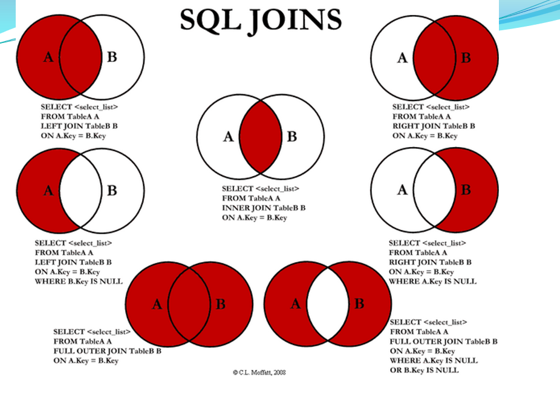

# MySQL
## SQL语句
### 根据已有的表创建新表
>* A：create table tab_new like tab_old (使用旧表创建新表)
>* B：create table tab_new as select 列名1,列名2... from tab_old definition only
### 增加一个列
>*  Alter table tabname **add column** 列名 数据类型
### 添加删除主键
>* Alter table tabname add primary key(列名)
>* Alter table tabname drop primary key(列名)
### 创建索引
>#### 直接创建
>* 列名 类型 索引类型 (id int unique)
>* 索引类型 index 索引名 (unique index index_id (id ASC))
>#### 在已存在的表上创建
>* alter 索引类型 index 索引名称 on 表明(列名)
### 增删改查
>* 选择：select * from table1 where 范围
>* 插入：insert into table1(field1,field2) values(value1,value2)
>* 删除：delete from table1 where 范围
>* 更新：update table1 set field1=value1 where 范围
>* 查找：select * from table1 where field1 like ’%value1%’ 
>* 排序：select * from table1 order by field1,field2 [desc]
>* 总数：select count as totalcount from table1
>* 求和：select sum(field1) as sumvalue from table1
>* 平均：select avg(field1) as avgvalue from table1
>* 最大：select max(field1) as maxvalue from table1
>* 最小：select min(field1) as minvalue from table1
### 连接查询
>#### 内连接查询
>* select * from 表1 inner join 表2 on 判定条件
>#### 外连接查询
>##### 左连接查询
>* 查询的结果为两个表匹配到的数据和右表特有的数据，对于左表中不存在的数据使用null填充
>* select * from students as s left join classes as c on s.cls_id = c.id
>##### 右连接查询
>* 查询的结果为两个表匹配到的数据和左表特有的数据，对于右表中不存在的数据使用null填充
>* select * from students as s right join classes as c on s.cls_id = c.id

>
## 事务
### 什么是事务
> 一个事物，要不同时都修改，要不同时都不修改
#### MySQL的事务
>* 默认事务：一条SQL就是一个事务，默认开启事务并提交事务
>* 手动事务：
>>* 显示的开启一个事物：start transaction
>>* 事务提交：commit代表从开启事务到事务提交，中间的所有SQL都认为有效，真正的更新数据库
>>* 事务的回滚：rollback代表事务回滚，从开启事务到事务回滚，中间的SQL操作都认为是无效操作
#### 事务的特性
>* 原子性：是指事务是一个不可分割的单位，要么都发生，要么都不发生
>* 一致性：一个事务，事务前后数据的完整性必须保持一致
>* 隔离性：事务的隔离性是指多个用户并发的访问数据库时，一个用户的事务不能被其他事务干扰，多个并发事务之间的数据要相互隔离
>* 持久性：一个数据一旦提交，他对数据库中的数据的改变就是永久的
#### 并发访问问题
>* 脏读：A事务读取到B事务尚未提交的数据
>* 不可重复度：一个数据两次读取的数据的内容不一致
>* 幻读：一个事务两次读取的数量不一致(事务A要查询两次，但是当事务A查询第一次后，事务B对数据进行了增加或者删除,这是事务A发现数据的总量和第一次的不一样)
#### 事务隔离级别
>* read uncommitted: 读取尚未提交的数据 不解决任何问题
>* read committed：读取已经提交的事务，解决脏读
>* repeatable read: 重复读取 可以解决脏读和不可重复读
>* serializable： 串行化 读共享锁，写排它锁，可以解决所有问题
## 索引
### 主键索引和唯一索引的区别
>* 主键是约束，唯一索引是索引
>* 一张表可以有很多唯一索引，但是只能创建一个主键
>* 主键的创建包含唯一索引
>* 主键的值不能为空
>* 主键可以作为外键，唯一索引不行
