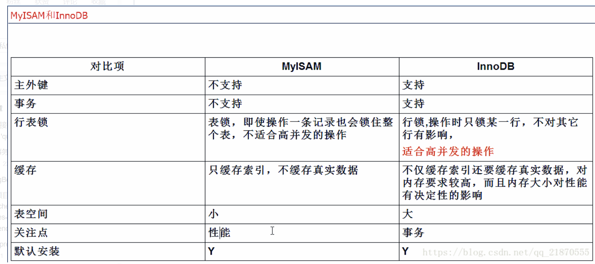

# MySQL
## 数据类型
### 整型
1. bit (布尔类型)
2. tinyint 只能输入0-255之间的整数
3. smallint -32768——32767
4. int 2的31次方
5. bigint 2的63次方
### 货币类型
> money,可以为四位小数
### 日期类型
1. date
2. datetime 
3. time 更精准
### 字符型
1. char(8000)：固定长度，8000为最大。例char(10)可以存10个字符，5个汉字
2. nchar(4000)：定常，4000为最大。例nchar(10)可以存10个字符，10个汉字
3. varchar(8000)：变长。例varchar(10)假如只输入5个，则只会占用5个，若为char(10)，只输入5个时，剩余的5位会用0补齐。
4. nvarchar(4000)：变长
5. nvarchar(max)：存储非常大
### char和varchar的区别
1. char是长度不可变的，varchar是长度可变的
2. char的存储和查找速度要比varchar快，因为其长度固定
3. char是用空间换取时间，varchar是用时间换取空间
4. char的存储方式是，英文字符占一个字节，汉字占两个字节，varcher的存储方式是，英文占两个字节，汉字也占两个字节
## SQL语句
### 根据已有的表创建新表
>* A：create table tab_new like tab_old (使用旧表创建新表)
>* B：create table tab_new as select 列名1,列名2... from tab_old definition only
### 增加一个列
>*  Alter table tabname **add column** 列名 数据类型
### 添加删除主键
>* Alter table tabname add primary key(列名)
>* Alter table tabname drop primary key(列名)
### 创建索引
>#### 直接创建
>* 列名 类型 索引类型 (id int unique)
>* 索引类型 index 索引名 (unique index index_id (id ASC))
>#### 在已存在的表上创建
>* alter 索引类型 index 索引名称 on 表明(列名)
### 增删改查
>* 选择：select * from table1 where 范围
>* 插入：insert into table1(field1,field2) values(value1,value2)
>* 删除：delete from table1 where 范围
>* 更新：update table1 set field1=value1 where 范围
>* 查找：select * from table1 where field1 like ’%value1%’ 
>* 排序：select * from table1 order by field1,field2 [desc]
>* 总数：select count as totalcount from table1
>* 求和：select sum(field1) as sumvalue from table1
>* 平均：select avg(field1) as avgvalue from table1
>* 最大：select max(field1) as maxvalue from table1
>* 最小：select min(field1) as minvalue from table1
### 连接查询
>#### 内连接查询
>* select * from 表1 inner join 表2 on 判定条件
>#### 外连接查询
>##### 左连接查询
>* 查询的结果为两个表匹配到的数据和右表特有的数据，对于左表中不存在的数据使用null填充
>* select * from students as s left join classes as c on s.cls_id = c.id
>##### 右连接查询
>* 查询的结果为两个表匹配到的数据和左表特有的数据，对于右表中不存在的数据使用null填充
>* select * from students as s right join classes as c on s.cls_id = c.id

>
## 两种引擎的区别
>
## 数据库的优化思路
1. 数据库的设计：数据表设计应遵循三大范式，使用适合的数据类型
2. 适当创建索引
3. 数据库扩展：数据库的分表分库，读写分离等
4. SQL语句的优化
## 三大范式
> 简单来说：

> 1NF:列表字段不可分;

>2NF:有主键且非主键依赖主键；

>3NF:非主键字段不能相互依赖;
## 事务
### 什么是事务
> 一个事物，要不同时都修改，要不同时都不修改
#### MySQL的事务
>* 默认事务：一条SQL就是一个事务，默认开启事务并提交事务
>* 手动事务：
>>* 显示的开启一个事物：start transaction
>>* 事务提交：commit代表从开启事务到事务提交，中间的所有SQL都认为有效，真正的更新数据库
>>* 事务的回滚：rollback代表事务回滚，从开启事务到事务回滚，中间的SQL操作都认为是无效操作
#### 事务的特性
>* 原子性：是指事务是一个不可分割的单位，要么都发生，要么都不发生
>* 一致性：一个事务，事务前后数据的完整性必须保持一致
>* 隔离性：事务的隔离性是指多个用户并发的访问数据库时，一个用户的事务不能被其他事务干扰，多个并发事务之间的数据要相互隔离
>* 持久性：一个数据一旦提交，他对数据库中的数据的改变就是永久的
#### 并发访问问题
>* 脏读：A事务读取到B事务尚未提交的数据
>* 不可重复度：一个数据两次读取的数据的内容不一致
>* 幻读：一个事务两次读取的数量不一致(事务A要查询两次，但是当事务A查询第一次后，事务B对数据进行了增加或者删除,这是事务A发现数据的总量和第一次的不一样)
#### 事务隔离级别
>* read uncommitted: 读取尚未提交的数据 不解决任何问题
>* read committed：读取已经提交的事务，解决脏读
>* repeatable read: 重复读取 可以解决脏读和不可重复读
>* serializable： 串行化 读共享锁，写排它锁，可以解决所有问题
## 索引
### 什么是索引
> mysql的索引也是一张表，并且是一个有序的表，主要记录了需要索引的数据的物理地址，   索引是对数据库中的表中的一列或者多列的值进行排列的一种结构，使用索引可以快速访问数据库中表的特定信息 
### 索引的优缺点
* **优点**
1. 可以提高数据检索的效率，降低数据的IO成本
2. 通过索引进行排序，降低了数据排序的成本，降低了CPU的消耗
>* 被索引的列会被自动排序
>* 如果按照索引进行排序，order by效率就提高很多
* **缺点**
1. 索引会占据磁盘空间
2. 索引提高查询速率，但是能降低更新速率，因为每次更新不单对数据进行更新，还要保存和更新对应的索引文件
### 索引类型
#### 主键索引
> ### 索引失效的几种情况
1. 条件中使用or，如果想使用or的话，又想让索引生效，之能将or条件的每个列上都加上索引
2. 复合索引的时候，如果条件不是复合索引的第一个值，则不会使用索引(最左原则)

> test只有复合索引(name,classid);

> select * from test where classid=3;将不用索引
3. 查询得到的数据是表数据的%30以上。
4. like查询是以%开头
5. 存在索引列的数据类型隐形转换，则用不上索引 比如String类型，必须加上'123'
6. where子句中对索引列进行数学运算
7. where子句对有索引列使用函数，用不上索引
8. not in和<>的条件不会使用索引
9. 默认值是NULL的数据索引不起作用，所以定义字段的时候，尽量用not null default 0等来定义。
### 什么时候不推荐使用索引
1. 数据唯一性差
2. 频繁更新的字段
3. 字段不在where中出现，**只有在where语句出现，MySQL才会使用索引**
4. 小表不需要加索引
### 字段建立索引的原则
1. 优先建立唯一索引，唯一索引的速度是最快的
2. 建立索引的字段最好是短字段，索引也需要占用磁盘空间，短字段更加合适，而且长字段也会增加查询时间
3. 表的索引并不是越多越好，适合的字段索引才能加快查询速度
4. 经常排序分组的字段需要加上索引
5. 一个表多个索引建立需要符合最左原则
### 主键索引和唯一索引的区别
>* 主键是约束，唯一索引是索引
>* 一张表可以有很多唯一索引，但是只能创建一个主键
>* 主键的创建包含唯一索引
>* 主键的值不能为空
>* 主键可以作为外键，唯一索引不行
### 锁的宏观分类
#### 乐观锁 CAS
>乐观锁是一种乐观的思想，认为读多写少，遇到并发写的可能性很低，认为每次别人拿取数据都不会做修改，所以不会上锁。但是在更新的时候会判断再次期间有没有人更新这个数据，采用的方法是在修改之前先读出当前版本号，在写回时再读取一遍版本号，如果两次的版本号相同的话，则执行写回操作。否则重新执行读取操作
#### 乐观锁的三大问题
* **ABA问题**
> 三个线程同时操作一个数据，第一个线程读取的为A，第二个线程改为B，第三个线程改为A
解决办法： 加一个自增的字段，或者比较时间戳
* **循环时间长开销大**
> CAS内部是一个do-while循环，在尝试更新某一个变量但是不成功的时候，会一直执行这个循环，会给CPU带来很大的压力
* **只能保证一个共享变量的原子操作**
#### 悲观锁
> 悲观锁就是悲观思想，认为写得多，每次都认为数据会被修改，所以每次读取数据的时候都会上锁，synchronize就是最常用的悲观锁。
#### 如何实现只能让一个线程进入
> synchronized，代表这个方法加锁，相当于不管哪一个线程（例如线程A），运行到这个方法时,都要检查有没有其它线程B（或者C、 D等）正在用这个方法(或者该类的其他同步方法)，有的话要等正在使用synchronized方法的线程B（或者C 、D）运行完这个方法后再运行此线程A，没有的话，锁定调用者，然后直接运行。
## union all 和nuion的区别
* union all是将所有结果都显示出来，不管重不重复
* union 是将所显示的结果进行并集操作 去除重复行

