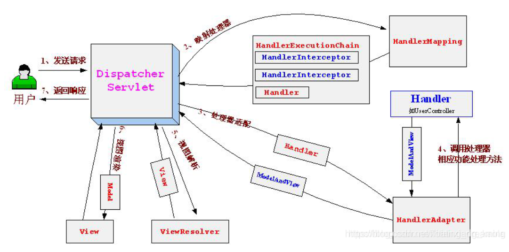

# SpringMVC
## 常用注解
1. controller
2. RequestMappping：给控制器绑定一个uri
3. ResponseBody: 将Java对象转化成json对象
4. RequestBody: 将客户端请求过来的json对象转化成Java对象
5. @RequestParam：当表单参数和方法形参名字不一致时，做一个名字映射
6. @PathVarible：用于获取URI中的参数
## 工作流程

1、用户发送请求至前端控制器DispatcherServlet。

2、DispatcherServlet收到请求调用HandlerMapping处理器映射器。

3、处理器映射器找到具体的处理器(可以根据xml配置、注解进行查找)，生成处理器对象及处理器拦截器(如果有则生成)一并返回给DispatcherServlet。

4、 DispatcherServlet调用HandlerAdapter处理器适配器。

5、HandlerAdapter经过适配调用具体的处理器(Controller，也叫后端控制器)。

6、Controller执行完成返回ModelAndView。

7、HandlerAdapter将controller执行结果ModelAndView返回给DispatcherServlet。

8、DispatcherServlet将ModelAndView传给ViewReslover视图解析器。

9、ViewReslover解析后返回具体View.

10、DispatcherServlet根据View进行渲染视图（即将模型数据填充至视图中）。 

11、DispatcherServlet响应用户。
