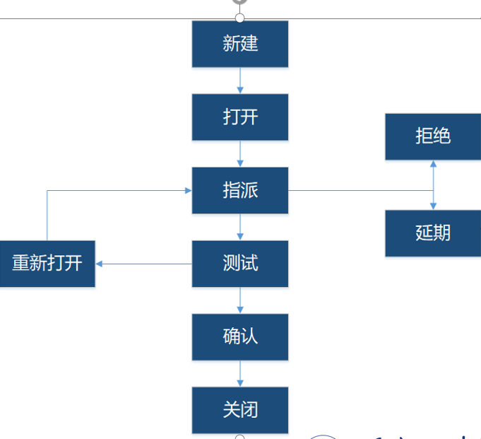

## 软件缺陷
### 定义
> 软件缺陷常常又被叫做Bug。所谓软件缺陷，即为计算机软件或程序中存在的某种破坏正常运行能力的问题、错误，或者隐藏的功能缺陷。缺陷的存在会导致软件产品在某种程度上不能满足用户的需要。
> #### 标准的定义
> 从产品内部看，缺陷是软件产品开发或维护过程中存在的错误、毛病等各种问题；
> 从从产品外部看，缺陷是系统所需要实现的某种功能的失效或违背。
### 一般地，软件缺陷定义如下：
>* 软件未达到产品说明书中标明的功能。
>* 软件出现了产品说明书中指明的不会出现的功能。  
>* 软件功能超出了产品说明书中指明的范围。  
>* 软件未达到产品说明书中指明应达到的目。  
>* 软件难以理解和使用、运行速度慢，或最终用户认为不好
### 软件缺陷的属性
>* 缺陷标识(Identifier)： 缺陷标识是标记某个缺陷的一组符号。每个缺陷必须有一个唯一的标识。
>* 缺陷类型(Type)：缺陷类型是根据缺陷的自然属性划分的缺陷种类。类别通常可以分为以下几种情况，界面  功能 性能 安全性 数据
>* 缺陷严重程度 (Severity) ： 缺陷严重程度是指因缺陷引起的故障对软件产品的影响程度。严重缺陷 较大 较小 轻微 其他
>* 缺陷优先级: 立即解决 高优先级 正常排队 低优先级
>* 缺陷状态：提交 以打开 已拒绝 已解决 已关闭 重新打
>* 缺陷起源：由需求 架构 设计 编码 测试 阶段引起的缺陷
### 缺陷的生命周期
>* 在软件开发过程中，缺陷拥有自身的生命周期。缺陷在走完其生命周期最终会关闭。确定的生命周期保证了过程的标准化。缺陷在其生命周期中会处于许多不同的状态。缺陷的生命周期如图。

>* **新建** 缺陷第一次递交时，他的状态为新建，也就是说，缺陷未被确定其是否为一个真正的缺陷
>* **打开**：在测试者提交一个缺陷后，测试组长确认其确实为一个缺陷的时候他会把状态置为“打开”。
>* **分配**：一旦缺陷被测试经理置为“打开”，他会把缺陷交给相应的开发人员或者开发组。这时缺陷状态变更为“分配”。
>* **测试**：当开发人员修复缺陷后，他会吧缺陷提交给测试组进行新一轮的测试。在开发人员公布已修复缺陷的程序之前，他会把缺陷状态置为“测试”。这时表明缺陷已经修复并且已经交给了测试组。
>* **延期**：缺陷状态被置为“延迟的”意味着缺陷将会在下一个版本中被修复。将缺陷置为“延迟的”原因有许多种。有些由于缺陷优先级不高，有些由于时间紧，有些是因为缺陷对软件不会造成太大影响。
>* **拒绝**：如果开发人员不认为其是一个缺陷，他会不接受。他会把缺陷状态置为“拒绝”。
>* **确认**：一旦缺陷被修复它就会被置为“测试”，测试员会执行测试。如果缺陷不再出现，这就证明缺陷被修复了同时其状态被置为“确认”。
>* **再次打开**：如果缺陷被开发人员修复后仍然存在，测试人员会把缺陷状态置为“再次打开”。缺陷即将再次穿越其生命周期。
>* **关闭**：一旦缺陷被修复，测试人员会对其进行测试。如果测试人员认为缺陷不存在了，他会把缺陷状态置为“关闭”。这个状态意味着缺陷被修复，通过了测试并且核实确实如此。
### 常见的缺陷管理工具
软件质量是软件的生命，它直接影响着软件的使用和维护。通常软件的质量有下面几个方面来评价质量的优劣：
>* 软件需求是衡量软件质量的基础，不符合需求的软件就不具备质量。设计的软件应在功能、性能等方面都符合要求，并能可靠地运行。
>* 软件结构良好，易读、易于理解，并易于修改、维护。
>* 软件系统具有友好的用户界面，便于用户使用。
>* 软件生存周期中各阶段文档齐全、规范，便于配置、管理。
* 软件质量特性：功能性 可靠性 可使用性 效率 可维护性 可移植性   

* 功能性 是指软件产品在指定条件下使用， 软件产品满足明确和隐含要求功能的能力
>* 适合性：是指软件产品与指定的任务和用户目标提供一组合适的功能的能力。
>* 准确性：是指软件产品具有所需精确度的正确或相符的结果及效果的能力。
>* 互操作性：是指软件产品与一个或多个规定系统进行交互的能力。
>* 保密安全性：是指软件产品保护信息和数据的能力，以使未授权的人员或系统不能阅读或修改这些信息和数据，但不拒绝授权人员或系统对其的访问。
>* 功能依从性：是指软件产品依附与同功能性相关的标准、约定或法规以及类似规定的能力。
* 可靠性：在指定条件下使用时，软件产品维持规定的性能级别的能力。
>* 成熟性：是指软件产品避免因软件中错误发生而导致失效的能力。
>* 容错性：是指在软件发生故障或违反指定接口的情况下，软件产品维持规定的性能级别的能力。
>* 易恢复性：是指在失效发生的情况下，软件产品重建规定的性能级别并恢复受直接影响的数据的能力。
>* 可靠性依从性：是指软件产品依附与同可靠性相关的标准、约定或法规以及类似规定的能力。
* 易用性：是指在指定条件下使用时，软件产品被理解、学习、使用和吸引用户的能力。
>* 易理解性：是指软件产品使用户能理解软件产品是否合适以及如何能将软件用于特定的任务和使用环境的能力。
>* 易学性：是指软件产品使用户能学习它的能力。
>* 易操作性：是指软件产品使用户能操作和控制它的能力。
>* 吸引性：是指软件产品吸引用户的能力。
>* 易用性依从性：是指软件产品依附与同易用性相关的标准、约定、风格指南或法规以及类似规定的能力。
* 效率：是指在规定条件下，相对于所用资源的数量，软件产品可提供适当的性能的能力。
>* 时间特性：是指在规定条件下，软件产品执行其功能时，提供适当的响应时间和处理时间以及吞吐率的能力。
>* 资源利用性：是指在规定条件下，软件产品执行其功能时，提供合适的数量和类型的资源的能力。
>* 效率依从性：是指软件产品依附与同效率相关的标准或约定的能力。
* 维护性：是指软件产品可被修改的能力，修改可能包括修正，改进或软件适应环境、需求和功能规格说明中的变化。
>* 易分析性：是指软件产品诊断软件中的缺陷或失效原因，以及判定待修改的部分的能力。
>* 易改变性：是指软件产品使指定的修改可以被实现的能力。
>* 稳定性：是指软件产品避免由于软件修改而造成意外结果的能力。
>* 易测试性：是指软件产品使已修改软件能被确认的能力。
>* 维护性依从性：是指软件产品依附与同维护性相关的标准或约定的能力。
* 可移植性：是指软件产品从一种环境迁移到另一种环境的能力。
>* 适应性：是指软件产品无需采用有别于为考虑该软件的目的而准备的活动或手段，就可能适应不同的指定环境的能力。
>* 共存性：是指软件产品在公共环境中同与其分享公共资源的其他独立软件共存的能力。
>* 易安装性：是指软件产品在指定环境中被安装的能力。
>* 易替换性：是指软件产品在环境相同、目的相同的情况下替代另一个指定软件产品的能力。
>* 可移植性依从性：是指软件产品依附与同可移植性相关的标准或约定的能力。
### 黑盒测试
> 是一种常用的软件测试方法，在应用这种方法设计测试用例时，把被测程序看成是一个打不开的黑盒，测试人员在不考虑程序内部结构和内部特性的情况下，只根据需求规格说明书，设计测试用例，检查程序的功能是否按照规范说明的规定正确地执行。
### 白盒测试
> 白盒测试方法将被测对象看做一个打开的盒子，允许人们检查其的内部结构。测试人员根据程序内部的结构特性，设计和选择测试用例，检测程序的每条路径是否都按照预定的要求正确地执行。
* 白盒穷举路径测试看起来它同穷举输入测试一样是不现实的。即使程序中每条路径都测试过了，仍不能保证程序没有故障。
>* 穷举路径测试不能保证程序实现符合规格说明的要求。
>* 穷举路径测试不可能查出程序中因遗漏路径而出现的错误。
>* 穷举路径测试可能发现不了有关数据的故障。
### 经济性
> 软件测试的一个基本问题是经济学问题。**软件测试的总目标是充分利用有限的人力和物力资源，高效率、高质量地完成测试**。为了降低测试成本，选择测试用例时应注意遵守测试的“经济性”原则：第一，根据程序的重要性和一旦发生故障将造成的损失来确定它的测试等级；第二，认真研究测试策略，以便能开发出尽可能少的测试用例，发现尽可能多的软件故障。
### 软件测试充分性
* 测试充分性准则是在测试之前，由相关各方根据质量、成本和进度等因素规定的，表现为对测试的要求与软件需求和软件现实有关，具有以下的一些基本性质：
>* 空测试对于任何软件测试都是不充分的。
>* 对任何软件都存在有限的充分测试数据集，这一性质称为有限性。
>>* 如果一个测试数据集对一个软件系统的测试是充分的，那么在增加一些测试用例也是充分的，这一性质称为单调性。
>>* 软件越复杂，需要的测试用例就越多，这一性质称为复杂性。
>>* 测试得越多，进一步测试所能得到的充分性增长就越少，这一性质称为回报递减律。
* Weyuker将公理系统应用到软件测试的研究中，给出了几条基于程序的测试数据集充分性公理。
>* 非外延性公理：如果有两个功能相同而实现不同的程序，对其中一个是充分的测试数据集对另一个不一定是充分的。
>* 多重修改公理：如果两个程序具有相同的语法结构，对一个是充分的测试数据集对另一个不一定是充分的。
>* 不可分解公理：对一个程序进行了充分的测试，并不表示对其中的成分都进行了充分的测试。
>* 非复合性公理：对程序各单元是充分的测试数据集并不一定对整个程序（集成后）是充分的。
### 软件测试原则
从不同的角度出发，软件测试会派生出两种不同的测试原则：
>* 用户希望通过软件测试能充分暴露软件中存在的问题和故障；
>* 开发者希望测试能表明软件产品已经正确地实现了用户的需求，没有软件故障存在。
* 软件测试是有风险的
>* 不能做到完全测试，不测试又会漏掉一些软件故障。我们的目标应该是使有限的测试投资获得最大的收益，即以有限的测试用例检查出尽可能多的软件故障
* 杀虫剂现象
* 测试无法显示隐藏的软件故障
* 存在的故障数量与发现的故障数成正比
* 并非所有软件故障都能修复
>* 没有足够的时间
>* 不值得修复
>* 修复风险太大
>* 不算真正的软件故障
* 不要丢弃测试用例
* 应避免测试自己编写的程序
* 软件测试是一项复杂的，具有创造性的和需要高度智慧的挑战性任务
### 测试停止准则
* 第一类标准：测试超过了预定的时间，停止测试。
* 第二类标准：执行了所有测试用例但没有发现故障，停止测试。
* 第三类标准：使用特定的测试用例方法作为判断测试停止的基础。
* 第四类标准：正面指出测试完成的要求，如发现并修改70个软件故障
* 第五类标准：根据单位时间内查出故障的数量决定是否停止测试。
### 软件开发过程及模型
* 软件开发过程是软件开发与维护的工作流程和工艺流程，是软件工程的重要组成部分。
* 软件开发过程是指软件设计思路和方法的一般过程，包括设计软件的功能，和实现的算法和方法，软件的总体结构设计和模块设计，编程和调试，程序联调和测试以及编写和提交程序
* 可行性研究-需求分析-概要设计-详细设计-实现-集成测试-确认测试-使用与维护