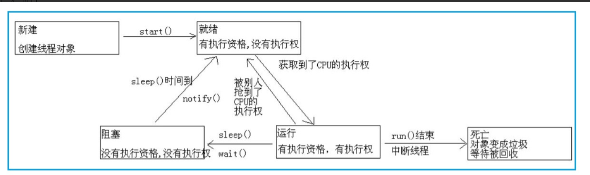

## 多线程
### 状态
* 新建 就绪 运行 阻塞 死亡 
> 
### 线程的实现
>* 继承thread类 重写run方法
>* 继承runnable接口 重写run方法
>* 继承callable接口 重写call方法
### runnable和callable的区别
>* callable在任务结束时有一个返回值
>* callable方法可以抛出异常
### run和start的区别
>* 通过start方法调用run方法，可以实现多线程
>* 直接调用run方法，就是一个普通的函数，没有启动线程，只有一个主程序
>* 总的来说start可以异步调用run方法，但是直接调用run方法是同步的
### 多线程实现同步的方法
>* synchronized关键字，两种声明方法
>>* synchronize方法：在方法声明前加synchronize关键字
>>* synchronize代码块：可以把任意代码块声明为synchronize，也可以指定上锁的对象
>* 当用synchronize修饰某个资源时，wait(),notify(),可以实现
>>* wait()阻塞线程，释放锁，等待唤醒
>>* notify()唤醒等待资源的线程
>* lock,以阻塞的方式活的锁，unlock以后，别的线程才会执行，必须手动释放，必须在finally()方法中
### sleep和wait的区别
>* 原理不同：sleep是thread的静态方法，使线程暂停一短时间，把执行机会让给其他线程，过指定时间后，会自动唤醒，wait是object的方法，唤醒方式只有notify或者指定的时间苏醒
>* sleep是让线程睡眠指定时间，不会释放锁，wait是让线程进入阻塞状态，并且释放锁，可能被别的线程唤醒
>* wait()必须在异步方法或者同步代码块中执行，sleep()在任何情况都可以执行
### 线程之间的交流
>* wait() notify()
>* await() signal()
### 线程池
* 一个线程池包括一下四个部分
>* **线程池管理器**：用于创建并管理线程池，包括线程池的创建和销毁，添加新的任务
>* **工作线程**：线程池中的线程，在没有任务时处于等待状态
>* **任务借口**：每个任务必须实现的接口，以供工作线程调度任务的执行
>* **任务队列**：用于存放没有处理的任务
* **线程池的常用参数**
>* **corePoolSize：核心线程数**，线程池维护的最小线程数量，核心线程创建后不会被回收，大于核心线程数的线程，在超过空闲线程存活时间的话，就会别收回
>* **maximumPoolSize：最大线程数**,线程池允许创建的最大的线程数，当添加一个任务时，核心线程数已满，线程池没有到达最大的线程数，并且没有空闲线程，**工作队列已满的情况下**，就会创建一个新的线程
>* **keepAliveTime：空闲线程存活时间**,当一个可以被收回的线程的空闲时间超过，就会被收回
>* **unit：时间单位**
>* **workQueue：工作队列**,存放待执行任务的队列,当提交的任务数超过核心线程数大小后，再提交的任务就存放在工作队列，任务调度时再从队列中取出任务。
>* **threadFactory：线程工厂** 创建线程的工厂，可以设定线程名、线程编号等。
>* **handler：拒绝策略**,当线程池线程数已满，并且工作队列达到限制，新提交的任务使用拒绝策略处理。拒绝策略有四种：
>>* AbortPolicy：丢弃任务并抛出RejectedExecutionException异常。
>>* DiscardPolicy：丢弃任务，但是不抛出异常。可能导致无法发现系统的异常状态。
>>* DiscardOldestPolicy：丢弃队列最前面的任务，然后重新提交被拒绝的任务。
>>* CallerRunsPolicy：由调用线程处理该任务。
## 集合
### 迭代器
>* 通过反复调用next方法，可以逐个访问集合中的每一个元素。但是，如果到达集合的末尾，next方法将抛出一个NoSushElementException。因此，需要在next之前调用hasnext方法。如果迭代器对象还有多个访问对象，就返回true。如果想要查询集合中的所有元素，就请求一个迭代器，当hasNext返回true是，就会反复的调用next。
### map的理解
1. Map主要用于存储键值对，根据键得到值，因此不允许键重复
2. 在java中的Java.util.Map 接口，有四个实现类，HashMap,HashTable,LinkedHashMap,TreeMap
3. 实现类
* hashMap是最常用的map，他是根据键的hashcode值存储数据，根据键可以直接获取他的值，具有很快的访问速度，不是线程安全的
> hashmap查询：
>1. 先根据key的值，算出索引
>2. 再根据索引获得索引位置所对应的链表
>3. 遍历键值对链表，找到键值对，拿到value
* hashtable与hashmap相似，不同的是，它不允许空的键或者值；但是支持线程同步，一次只允许一个线程通过，所以写入的速度会很慢
* linkedhashmap 是hashmap的子类。特点是插入的时候按照应用次数排序，遍历时得到的数据是先插入的
* treemap，把键按照升序进行排序，得到的数据都是排好序的
### List Map Set之间的区别
1. List在Java中是有序的，可重复的
2. Set可以存储唯一的，无序的对象
3. Map，存储键值对，多个key可以存储相同的值，但key不能重复
### ArrayList和LinkedList有什么区别？
1. 都是不同步的，不能保证线程的安全
2. ArrayList底层使用的是object数组，linkedlist底层使用的是双向链表
3. 插入和删除元素，ArrayList是数组，插入和删除很麻烦，时间复杂度受到元素位置的影响，O(n)。linkedlist是链表，时间复杂度不受元素位置的影响，O(1)
4. linkedlist不支持快速随机访问，ArrayList支持
5. 内存占用 ArrayList占用的少
### ArrayList和vector的区别
1. vector的所用方法都是同步的，是线程安全的，但是单线程访问，比较耗费时间
2. ArrayList是不同步的，所以他不需要保证线程安全的使用
### hashmap和hashtable的区别
1. hashmap是非线程安全的，hashtable是线程安全的，内部的方法都经过synchronize修饰
2. hashmap的效率要比hashtable的效率高
3. hashmap中的null可以作为键，但是只能有一个，hashtable中的null不能作为键
### hashmap和hashset的区别
1. hashmap实现了map接口 hashset实现了set接口
2. hashmap存储的是键值对，hashset存储的仅仅是对象
3. hashmap使用的是put方法存储对象，hashset使用的是add方法
4. hashmap使用的是键来计算hashcode的值，hashset使用的是对象来计算hoshcode的值，对于两个对象来说，hashcode可能相同，所以用equal来比较两个对象是否相同，如果相同的话，就会返回false
5. hashmap获取对象比hashset快
## 锁
### 锁的宏观分类
#### 乐观锁 CAS
>乐观锁是一种乐观的思想，认为读多写少，遇到并发写的可能性很低，认为每次别人拿取数据都不会做修改，所以不会上锁。但是在更新的时候会判断再次期间有没有人更新这个数据，采用的方法是在修改之前先读出当前版本号，在写回时再读取一遍版本号，如果两次的版本号相同的话，则执行写回操作。否则重新执行读取操作
#### 乐观锁的缺点
* **ABA问题**
> 三个线程同时操作一个数据，第一个线程读取的为A，第二个线程改为B，第三个线程改为A
解决办法： 加一个自增的字段，或者比较时间戳
#### 悲观锁
> 悲观锁就是悲观思想，认为写得多，每次都认为数据会被修改，所以每次读取数据的时候都会上锁，synchronize就是最常用的悲观锁。
#### 如何实现只能让一个线程进入
> synchronized，代表这个方法加锁，相当于不管哪一个线程（例如线程A），运行到这个方法时,都要检查有没有其它线程B（或者C、 D等）正在用这个方法(或者该类的其他同步方法)，有的话要等正在使用synchronized方法的线程B（或者C 、D）运行完这个方法后再运行此线程A，没有的话，锁定调用者，然后直接运行。