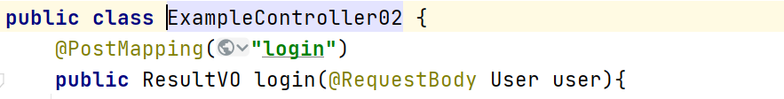
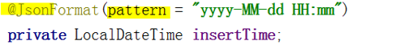
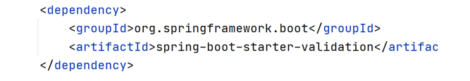

# SpringMVC
### 实现过程
>1. 容器启动时，扫描到Controller组件，注册controller请求处理方法配置到**HandlerMapping**
>2. **Dispatcher**(分发器)拦截请求
>3. Dispatcher 调用HandlerMapping查找与请求必配的Controller组件，并将将请求转发给controller方法处理
>4. Controller方法调用业务逻辑组件处理业务逻辑
>5. Controller方法，序列化请求需要的数据，返回
   
### @Controller
> 表明了这个类是一个**控制器类**
### @ResponseBody
>* @ResponseBody表示方法的返回值直接以指定的格式写入Http response body中，而不是解析为跳转路径。
>* 如果要求方法返回的是json格式数据，而不是跳转页面，可以直接在类上标注@RestController，而不用在每个方法中标注@ResponseBody，简化了开发过程。
### @RestController
> 作用等同于@Controller + @ResponseBody
### @RequestMapping
>* 请求映射，类型级方法级
>* @GetMapping/@PostMapping/@PatchMapping/@PutMapping/@DeleteMapping。分别对应HTTP请求类型
### 对应的HTTP请求
>* **GET**，**获取**，仅基于请求地址参数获取数据，无请求体
>* **PUT**，**更新**，仅基于请求地址参数更新数据，无请求体
例如，基于地址传入的用户主键，重置其密码。无需输入数据
>* **PATCH**，**更新**，向请求地址提交数据，更新数据封装在请求体
>* **DELETE**，**删除**，基于请求地址参数删除数据，无请求体
例如，基于地址传入的主键，删除
>* **POST**，**创建**，向请求地址提交数据，创建数据封装在请求体

### @RequestBody
>* @RequestBody，指定controller方法参数绑定到请求体，基于jackson将请求数据**反序列化**为Java对象
>* POST请求必须显示**声明**请求体类型
  

### @PathVariable
>* 参数级注解
>* Name属性，声明地址栏传入的参数名称，默认与注入方法的参数名称相同
``` java
@GetMapping("addresses/{aid}")
    public ResultVO postAddress(@PathVariable("aid") int aid){

    }
```
### @JsonFormat，在属性声明格式



## 统一处理异常
> ### @ControllerAdvice
> 用于统一处理所有controller组件的相关操作
> ### @RestControllerAdvice
> 整合@ControllerAdvice & @ResponseBody，直接返回json数据
> ### @ExceptionHandler 
> 修饰声明在@ControllerAdvice类中的处理方法，**处理Spring容器捕获的指定异常**(全局异常处理)
> ### 实现过程
> 1. 执行此方法将抛出受检异常转抛为自定义非受检异常,声明业务码及异常信息
```Java
try {
        Files.readString(Path.of("A:/aa.aa"));
} catch (IOException e) {
        throw new MyException("读取文件错误"+e.getMessage(), 500);
}
```
> 2. 自定义非受检异常封装业务码/异常信息
```Java
public class MyException extends RuntimeException{
    private int code;

    public MyException(String message,int code){
        super(message);
        this.code = code;
    }
}
```
> 3.自定义统一异常处理组件,定义处理指定异常方法,自动在方法注入异常对象返回json数据
```Java
@Slf4j
@RestControllerAdvice //自定义统一处理异常组件
public class ExceptionController02 {
    @ExceptionHandler(MyException.class)//指定处理异常
    public ResultVO handleValidException(MyException myException){
        return ResultVO.error(myException.getCode(),myException.getMessage());
    }
}
```
### Bean Validation
>* 校验用户输入信息以维护数据完整性正确性，是应用程序逻辑的重要组成部分
>* SpringMVC默认不再包含校验依赖
添加spring-boot-starter-validation**校验依赖**。也可创建项目时直接声明引入


>#### 参数和用法
>* @Null	必须为null	
>* @NotNull	必须不能为null	
>* @AssertFalse/
@AssertTrue	必须为真/假@AssertFalse 
boolean isUnsupported;
>* @Digits(integer,fraction)	必须是小数，整数位数不能超过integer，小数位数不能超过fraction	@Digits(integer=6, fraction=2) 
BigDecimal price;
>* @Max/@Min	必须为一个大于/小于指定值的数字	
>* @Size(min, max)	字符长度	@Size(min=2, max=6) 
String briefMessage;
>* @Future/@Past	必须是一个未来/过去的日期	@Past Date birthday;
>* @Pattern(regexp)	必须是符合表达式	
>* @Pattern(regexp = "^(.+)@(.+)$“)
String email；
>* @Email
>### @Valid
> 修饰需要校验的，包含校验规则的参数对象
>#### 用法
```java
@PostMapping("users")
public void postUser(@Valid @RequestBody User03 user){
}
```
>#### 参数对象
```Java
public class User03 {
    private int id;
    @Size(min = 2, max = 6)
    private String name;
    @Min(value = 18)
    @Max(value = 60)
    private int age;
    @Email
    private String email;
}
```
>#### MethodArgumentNotValidException异常
>* 校验失败，springmvc将抛出异常，封装校验失败异常信息
>* BindingResult **getBindingResult()**，获取绑定的结果
>>*  List<FieldError> getFieldErrors()，获取校验属性失败信息
>* FieldError类，封装属性错误
>>* String getField()，校验失败属性名称
>>* String getDefaultMessage()，失败描述信息
>#### 实现过程
> 1. 首先在参数对象的校验里面添加message，表示校验失败后要返回的信息
```java
 //${validatedValue}:实际输入值
 //{max} {min} {vaule}:约束值
 public class User03 {
    private int id;
   @Size(min = 2, max = 6,
            message = "您输入的值为${validatedValue}，用户名长度必须大于{min}，小于{max}")
    private String name;
    @Min(value = 18,
            message = "您输入的值为${validatedValue}，年龄不能小于{value}")
    @Max(value = 60,
            message = "您输入的值为${validatedValue}，年龄不能大于{value}")
    private int age;
    @Email(message = "Email不合法")
    private String email;
}
```
> 2. 写一个全局异常统一处理类
```java
//全局处理异常 说明处理方法的类型
@ExceptionHandler(MethodArgumentNotValidException.class)
// 异常对象可直接注入方法使用
public ResultVO handleValidException(MethodArgumentNotValidException exception){
        StringBuilder strBuilder = new StringBuilder();
        exception.getBindingResult() //获取绑定结果
                 .getFieldErrors() //获取校验失败信息
                 .forEach(e->{
                    strBuilder.append(e.getField()); //获取校验失败信息
                    strBuilder.append(":");
                    strBuilder.append(e.getDefaultMessage());  //获取校验失败信息描述
                    strBuilder.append(";");
                });
        //直接返回拼接结果
        return ResultVO.error(400,strBuilder.toString());
    }
```
### MethodArgumentTypeMismatchException异常
> 请求地址参数类型转换异常
### Security
>* Spring提供了一套安全框架，处理加密/解密数据信息
>* 提供了包括对称/非对称加密，不同Hash算法等一系列实现
### PasswordEncoder(org.springframework.security.crypto.password)接口
>* String encode(CharSequence rawPassword)，编码密码
>* boolean matches(CharSequence rawPassword, String encodedPassword)，验证原始密码与编码密码
### BCryptPasswordEncoder类
>* Bcrypt算法，自动生成随机盐值，并附在结果，避免盐值的单独保存
>* 128bits随机二进制数，16bytes，base64，24chars，特殊算法转为22chars
```java
//直接将PasswordEncoder组件注入容器
@Bean
public PasswordEncoder getPasswordEncoder() {
        // 返回一个BCryptPasswordEncoder()类
        return new BCryptPasswordEncoder();
}
```
### Jackson ObjectMapper
>* SpringMVC默认基于Jackson实现序列化/反序列化
>* SpringMVC自动注入Jackson ObjectMapper映射对象到容器
>>* String writeValueAsString(T payload)，将对象序列化为json字符串
>>* T readValue(String content, Class c)，将json字符串反序列化为指定类型的Java对象
>* readValue无法反序列化带有泛型的类型，**TypeReference抽象类**。创建子类，具体化泛型。可通过创建类似接口的匿名内部类实现
```java
public void test_mapper2() throws JsonProcessingException {
        User04 user = new User04();
        user.setUserName("BO");
        user.setPassword("123456");
        Map<String,User04> map = Map.of("user",user);
        String json = objectMapper.writeValueAsString(map);
        log.debug(json);
        // TypeReference抽象类实现对带泛型的类反序列化
        // User04 u = objectMapper.readValue(json,User04.class); 普通类，直接用就行
        Map<String,User04> reMp = objectMapper.readValue(json, new TypeReference<Map<String, User04>>() {
        });
        reMp.forEach(
                (k,v)->{
                    log.debug(k);
                    log.debug(v.getUserName());
                    log.debug(v.getPassword());
                }
        );
    }
```
### Token
>* 原Web服务，用户登陆后在HttpSession保存用户信息，通过过滤器实现对指定路径请求的拦截过滤，通过HttpSession中信息实现权鉴
>* Restful设计思想，服务器端不再保存用户状态(无HttpSession)
>>* 用户登录后，将用户身份/权限信息加密封装在Token(令牌)
>>* 将token信息通过http header返给客户端
>>* 客户端每次需要身份/权限的请求，均需在header携带token
>>* 服务器端拦截请求，从token中解密出信息鉴权
## Encryption Algorithm
>* 加密/解密算法，适合敏感数据的加密传输
>>* **对称加密算法(AES等)**，通过相同密钥加密/解密
>>* **非对称加密算法(RSA等)**，公钥加密的数据，必须通过私钥才能解密
>* Spring-Security提供基于256bits PBKDF2对称算法的实现
>* 提供不可泄露的，加密密钥SecretKey(任意长度字符串)
>* 提供不可泄露的，16位十六进制数固定长度的的盐值(64位二进制数)
>* **TextEncryptor Encryptors.text(secretKey, salt)**，基于指定密钥/盐值创建文本加密器
>>* **String encrypt(payload)**，加密指定字符串
>>* **String decrypt(encryptString)**，解密指定字符串
>* 先验证后解密。篡改的数据无法通过验证抛出异常，避免解密浪费资源
* 在application.yml中，声明密钥和盐值
```java
my:
  secretkey: R28K42ZEJ8LWRHU5
  salt: 636eac2534bcfcb0
```
#### 加密过程
```java
public String encrypt(Map<String,Object> payload){
        try {
            // 将传过来的数据序列化成字符串
            String json = mapper.writeValueAsString(payload);
            return encryptor.encrypt(json);
        } catch (JsonProcessingException e) {
            throw new MyException("服务器端错误",500);
        }
    }
```
#### 加密测试过程
```java
    @Test
    public void test_encrypt(){
        Map<String,Object> map = Map.of("uid",12345678,"role",9);
        String re = encrypt.encrypt(map);
        log.debug(re);
        log.debug("{}",re.length());
    }
```
#### 解密过程
```java
public Map<String,Object> decrypt(String auth){
        String json = encryptor.decrypt(auth);
        try {
            return mapper.readValue(json,Map.class);
        } catch (JsonProcessingException e) {
            throw new MyException("无权限",403);
        }
    }
```
#### 解密测试
```java 
    public void test_decrypt(){
        Map<String,Object> token = encrypt.decrypt("a8b8d75da93bd05fba7756dc5e3781dc9b75f1e3a5ece764d9e9d8248d2700c2245b2f791ffc622a6fd3e7c0b7f84e17");
        log.debug("{}",token.get("uid"));
        log.debug("{}",token.get("role"));
//        token.forEach(
//                (k,v)->{
//                    log.debug(v.toString());
//                }
//        );
    }
}
```