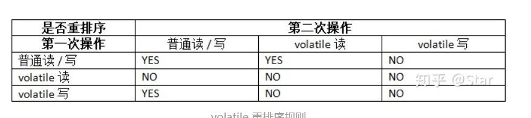
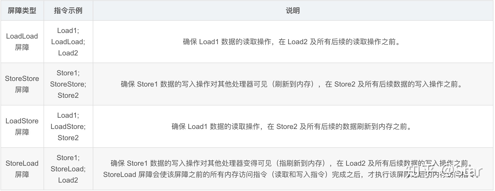
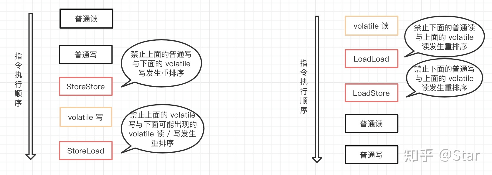
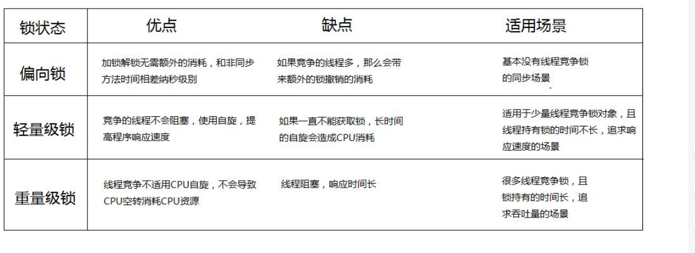
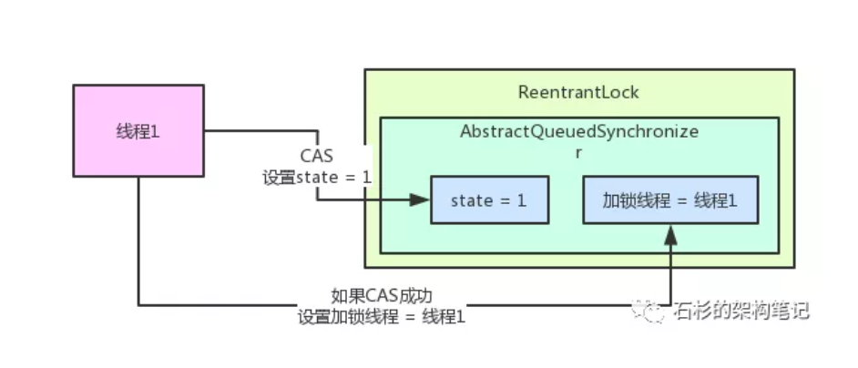
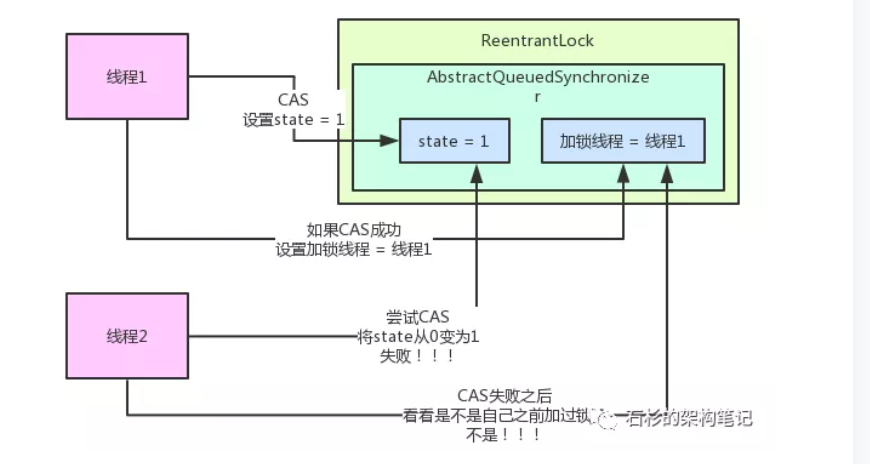
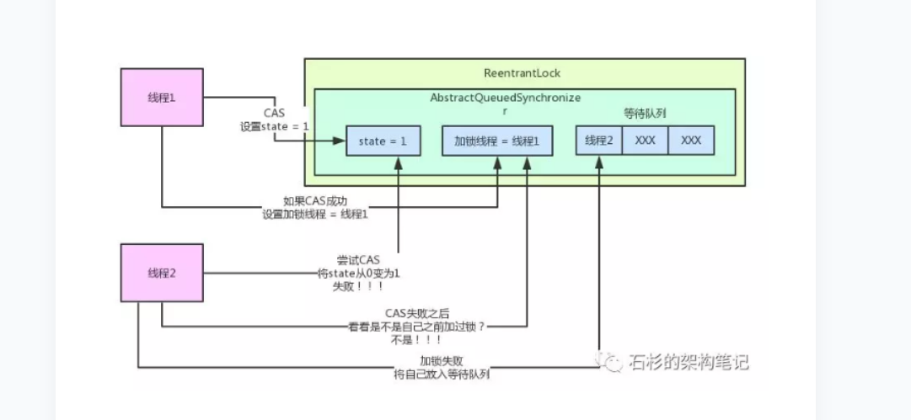

    
## 多线程
### 基础
#### join的用法
> 在很多情况下，主线程生成并起动了子线程，如果子线程里要进行大量的耗时的运算，主线程往往将于子线程之前结束，但是如果主线程处理完其他的事务后，需要用到子线程的处理结果，也就是主线程需要等待子线程执行完成之后再结束，这个时候就要用到join()方法了。
### 状态
* 新建 就绪 运行 阻塞 死亡 
> 
### 线程的实现
>* 继承thread类 重写run方法
>* 继承runnable接口 重写run方法
>* 继承callable接口 重写call方法
### runnable和callable的区别
>* callable在任务结束时有一个返回值
>* callable方法可以抛出异常
### run和start的区别
>* 通过start方法调用run方法，可以实现多线程
>* 直接调用run方法，就是一个普通的函数，没有启动线程，只有一个主程序
>* 总的来说start可以异步调用run方法，但是直接调用run方法是同步的
### 多线程实现同步的方法
>* synchronized关键字，两种声明方法
>>* synchronize方法：在方法声明前加synchronize关键字
>>* synchronize代码块：可以把任意代码块声明为synchronize，也可以指定上锁的对象
>* 当用synchronize修饰某个资源时，wait(),notify(),可以实现
>>* wait()阻塞线程，释放锁，等待唤醒
>>* notify()唤醒等待资源的线程
>* lock,以阻塞的方式活的锁，unlock以后，别的线程才会执行，必须手动释放，必须在finally()方法中
### sleep和wait的区别
>* 原理不同：sleep是thread的静态方法，使线程暂停一短时间，把执行机会让给其他线程，过指定时间后，会自动唤醒，wait是object的方法，唤醒方式只有notify或者指定的时间苏醒
>* sleep是让线程睡眠指定时间，不会释放锁，wait是让线程进入阻塞状态，并且释放锁，可能被别的线程唤醒
>* wait()必须在异步方法或者同步代码块中执行，sleep()在任何情况都可以执行
### 并发编程的三个概念
* 原子性
* 可见性
* 有序性
### volatile 的作用
1. 保证变量的内存可见性
> 当一个线程修改了某个变量的值，其它线程总是能知道这个变量变化。
2. 禁止指令重排序
### 嗅探机制工作原理
> 每个处理器通过监听在总线上传播的数据来检查自己的缓存值是不是过期了，如果处理器发现自己缓存行对应的内存地址修改，就会将当前处理器的缓存行设置无效状态，当处理器对这个数据进行修改操作的时候，会重新从主内存中把数据读到处理器缓存中。
### volatile 的原子性问题
* 在多线程环境下，volatile 关键字可以保证共享数据的可见性，但是并不能保证对数据操作的原子性。也就是说，多线程环境下，使用 volatile 修饰的变量是**线程不安全的**。
* 对任意单个使用 volatile 修饰的变量的读 / 写是具有原子性，但类似于 flag = !flag，flag++ 这种复合操作不具有原子性。简单地说就是，**单纯的赋值操作是原子性的。**
### 用volatile修饰之后就变得不一样

　　第一：使用volatile关键字会强制将修改的值立即写入主存；

　　第二：使用volatile关键字的话，当线程2进行修改时，会导致线程1的工作内存中缓存变量stop的缓存行无效（反映到硬件层的话，就是CPU的L1或者L2缓存中对应的缓存行无效）；

　　第三：由于线程1的工作内存中缓存变量stop的缓存行无效，所以线程1再次读取变量stop的值时会去主存读取
### 什么是重排序？
* 为了提高性能，在遵守 **as-if-serial 语义**（即不管怎么重排序，单线程下程序的执行结果不能被改变。编译器，runtime 和处理器都必须遵守。）的情况下，编译器和处理器常常会对指令做重排序
### 重排序分类
* **编译器重排序：** 编译器在不改变单线程程序语义的前提下，可以重新安排语句的执行顺序。
* **指令级并行重排序：** 现代处理器采用了指令级并行技术来将多条指令重叠执行。如果不存在数据依赖性，处理器可以改变语句对应机器指令的执行顺序。
* **内存系统重排序：** 由于处理器使用缓存和读 / 写缓冲区，这使得加载和存储操作看上去可能是在乱序执行。

  > 
### 什么是数据依赖
* 如果两个操作访问同一个变量，且这两个操作中有一个为**写操作**，此时这两个操作之间就存在数据依赖性。这里所说的数据依赖性仅针对单个处理器中执行的指令序列和单个线程中执行的操作，不同处理器之间和不同线程之间的数据依赖性不被编译器和处理器考虑。
### 内存屏障指令
  > 
### JMM 把内存屏障指令分为下列四类：
> 
###  volatile 读 / 写时是如何插入内存屏障的
> 
### volatile 在单例模式中的应用
* 懒汉式单例双重检测模式中就使用到了 volatile 关键字。
```java
public class Singleton {
    // volatile 保证可见性和禁止指令重排序
    private static volatile Singleton singleton;

    public static Singleton getInstance() {
        // 第一次检查
        if (singleton == null) {
          // 同步代码块
          synchronized(this.getClass()) {
              // 第二次检查
              if (singleton == null) {
                    // 对象的实例化是一个非原子性操作
                    singleton = new Singleton();
                }
            }
        }
        return singleton;
    }
}
```
* 创建对象分为三步：
>* 分配对象的内存空间
>* 实例化对象
>* 设置指向内存地址
### volatial总结
1. volatile 修饰符适用于以下场景：某个属性被多个线程共享，其中有一个线程修改了此属性，其他线程可以立即得到修改后的值；或者作为状态变量，如 flag = ture，实现轻量级同步。
2. volatile 属性的读写操作都是无锁的，它不能替代 synchronized，因为它没有提供原子性和互斥性。因为无锁，不需要花费时间在获取锁和释放锁上，所以说它是低成本的。
3. volatile 只能作用于属性，我们用 volatile 修饰属性，这样编译器就不会对这个属性做指令重排序。
4. volatile 提供了可见性，任何一个线程对其的修改将立马对其他线程可见。volatile 属性不会被线程缓存，始终从主存中读取。
5. volatile 提供了 happens-before 保证，对 volatile 变量 V 的写入 happens-before 所有其他线程后续对 V 的读操作。
volatile 可以使纯赋值操作是原子的，如 boolean flag = true; falg = false
6. volatile 可以在单例双重检查中实现可见性和禁止指令重排序，从而保证安全性。
### 线程之间的交流
>* wait() notify()
>* await() signal()
### 线程池
* 一个线程池包括一下四个部分
>* **线程池管理器**：用于创建并管理线程池，包括线程池的创建和销毁，添加新的任务
>* **工作线程**：线程池中的线程，在没有任务时处于等待状态
>* **任务借口**：每个任务必须实现的接口，以供工作线程调度任务的执行
>* **任务队列**：用于存放没有处理的任务
* **线程池的常用参数**
>* **corePoolSize：核心线程数**，线程池维护的最小线程数量，核心线程创建后不会被回收，大于核心线程数的线程，在超过空闲线程存活时间的话，就会别收回
>* **maximumPoolSize：最大线程数**,线程池允许创建的最大的线程数，当添加一个任务时，核心线程数已满，线程池没有到达最大的线程数，并且没有空闲线程，**工作队列已满的情况下**，就会创建一个新的线程
>* **keepAliveTime：空闲线程存活时间**,当一个可以被收回的线程的空闲时间超过，就会被收回
>* **unit：时间单位**
>* **workQueue：工作队列**,存放待执行任务的队列,当提交的任务数超过核心线程数大小后，再提交的任务就存放在工作队列，任务调度时再从队列中取出任务。
>* **threadFactory：线程工厂** 创建线程的工厂，可以设定线程名、线程编号等。
>* **handler：拒绝策略**,当线程池线程数已满，并且工作队列达到限制，新提交的任务使用拒绝策略处理。拒绝策略有四种：
>>* AbortPolicy：丢弃任务并抛出RejectedExecutionException异常。
>>* DiscardPolicy：丢弃任务，但是不抛出异常。可能导致无法发现系统的异常状态。
>>* DiscardOldestPolicy：丢弃队列最前面的任务，然后重新提交被拒绝的任务。
>>* CallerRunsPolicy：由调用线程处理该任务。
### 线程池优点
1. 降低资源消耗 重复利用已创建线程
2. 提高响应速度 任务到达时，无需等待，创建线程即可执行
3. 提高线程的管理性 
* 好处是减少了创建销毁线程所消耗的时间以及系统的资源
### 线程池的使用
* **FixedThreadPool**
> 创建一个规定大小的线程池，可控制并发的线程数，超出的任务会在队列中等待
* **CachedThreadPool**
> 创建一个可缓存的线程池，若线程数超过处理所需，缓存一段时间后会回收，若线程数不够，则新建线程
>* **特点**
>* 工作线程创建数量没有限制
>* 线程空闲了指定时间就会自动销毁
* **SingleThreadExecutor**
> 创建单个线程数的线程池，它可以保证先进先出的执行顺序。 
## 锁

#### synchronized可以使用的地方
1. 修饰实例方法 当前实例对象的this加锁
2. 修饰静态变量 当前对象的class对象加锁
3. 修饰代码块 给指定对象加锁
#### synchronize底层原理
> 每个对象都有对象头，对象的头部有MarkWord，有两个bit用来标志锁，有一个bit用来标志是否是偏向锁，另一个bit是锁标志位。说以synchronize给对象加锁就是改变这两个数值。所有线程都是根据所标志位的数值来判断这个对象是否上锁
#### 锁升级的过程
* 对象大致可以分为三个部分，分别是对象头，实例变量，填充字节

>* 对象头，主要包含两部分1. Mark Word （标记字段），2.Klass Pointer（类型指针）。
* **偏向锁**
>* **原理** ：当一个线程访问同步代码块并获取锁时，会在对象的头部栈帧中的锁记录里存储偏向锁的线程ID，以后该线程进去不需要进行CAS操作来加锁和解锁
>* **锁的升级**：
当另一个线程访问代码块的时候，先看看记录偏向锁的线程ID是不是自己的线程，如果是，就直接进入，如果不是，就判断那个线程是不是存活，如果不存活，就将对象至于无所状态，如果存活的话，就暂停该线程，撤销偏向锁，升级为轻量级锁
* **轻量级锁**
> 线程1获取轻量级锁时会**先把锁对象的对象头MarkWord复制一份到线程1的栈帧中创建的用于存储锁记录的空间**（称为DisplacedMarkWord），然后使**用CAS把对象头中的内容替换为线程1存储的锁记录**（DisplacedMarkWord）的地址；

> 如果在线程1复制对象头的同时（在线程1CAS之前），线程2也准备获取锁，复制了对象头到线程2的锁记录空间中，但是在线程2CAS的时候，发现线程1已经把对象头换了，线程2的CAS失败，那么**线程2就尝试使用自旋锁来等待线程1释放锁。** 自旋锁简单来说就是让线程2在循环中不断CAS

> 但是如果自旋的时间太长也不行，因为自旋是要消耗CPU的，因此自旋的次数是有限制的，比如10次或者100次，如果自旋次数到了线程1还没有释放锁，或者线程1还在执行，线程2还在自旋等待，这时又有一个线程3过来竞争这个锁对象，那么这个时候轻量级锁就会膨胀为重量级锁。重量级锁把除了拥有锁的线程都阻塞，防止CPU空转。
> 
### 自旋锁
> 自旋锁：自旋锁是一种特殊的互斥锁，当资源被加锁后，其他线程想要再次加锁，此时该线程不会被阻塞睡眠而是陷入循环等待状态（不能在做其它事情），循环检查资源持有者是否已经释放了资源，这样做的好处是减少了线程从睡眠到唤醒的资源消耗，但会一直占用CPU的资源。适用于资源的锁被持有的时间短，而又不希望在线程的唤醒上花费太多资源的情况。
### 读写锁
> 读写锁：它拥有读状态加锁、写状态加锁、不加锁这三种状态。
只有一个线程可以占有写状态的锁，但可以有多个线程同时占有读状态锁，这也是它可以实现高并发的原因。当其处于写状态锁下，任何想要尝试获得锁的线程都会被阻塞，直到写状态锁被释放；如果是处于读状态锁下，允许其它线程获得它的读状态锁，但是不允许获得它的写状态锁，直到所有线程的读状态锁被释放；为了避免想要尝试写操作的线程一直得不到写状态锁，当读写锁感知到有线程想要获得写状态锁时，便会阻塞其后所有想要获得读状态锁的线程。所以读写锁非常适合资源的读操作远多于写操作的情况。
### 互斥锁
> 互斥锁：共享资源的使用是互斥的，即一个线程获得资源的使用权后就会将该资源加锁，使用完后会将其解锁，如果在使用过程中有其他线程想要获取该资源的锁，那么它就会被阻塞陷入睡眠状态，直到该资源被解锁才会被唤醒，如果被阻塞的资源不止一个，那么它们都会被唤醒，但是获得资源使用权的是第一个被唤醒的线程，其它线程又陷入沉睡
## ReentrantLock和AQS的关系
* ReentrantLock内核中锁机制的实现都是依赖AQS组件来实现的
* AQS有两个元素
>* state是int类型，代表了加锁的状态
>* 加锁的线程 = null
* 可重入加锁就是state累加1
* 单线程加锁
> 
* 多线程加锁
> 
* 加锁失败后
> 