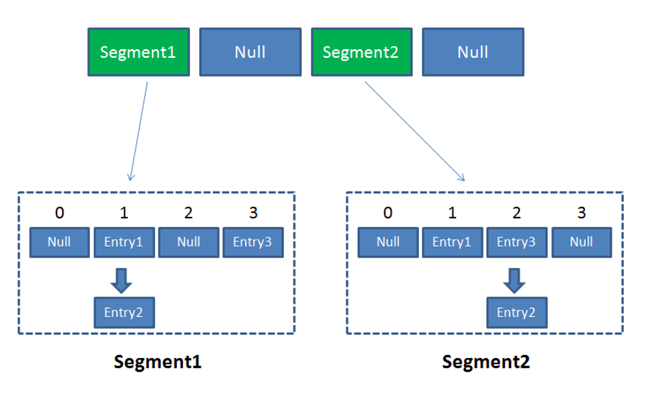

## 集合
### 迭代器
>* 通过反复调用next方法，可以逐个访问集合中的每一个元素。但是，如果到达集合的末尾，next方法将抛出一个NoSushElementException。因此，需要在next之前调用hasnext方法。如果迭代器对象还有多个访问对象，就返回true。如果想要查询集合中的所有元素，就请求一个迭代器，当hasNext返回true是，就会反复的调用next。
### map的理解
1. Map主要用于存储键值对，根据键得到值，因此不允许键重复
2. 在java中的Java.util.Map 接口，有四个实现类，HashMap,HashTable,LinkedHashMap,TreeMap
3. 实现类
* hashMap是最常用的map，他是根据键的hashcode值存储数据，根据键可以直接获取他的值，具有很快的访问速度，不是线程安全的
> hashmap查询：
>1. 先根据key的值，算出索引
>2. 再根据索引获得索引位置所对应的链表
>3. 遍历键值对链表，找到键值对，拿到value
* hashtable与hashmap相似，不同的是，它不允许空的键或者值；但是支持线程同步，一次只允许一个线程通过，所以写入的速度会很慢
* linkedhashmap 是hashmap的子类。特点是插入的照次时应候按用数排序，遍历时得到的数据是先插入的
* treemap，把键按照升序进行排序，得到的数据都是排好序的
### List Map Set之间的区别
1. List在Java中是有序的，可重复的
2. Set可以存储唯一的，无序的对象
3. Map，存储键值对，多个key可以存储相同的值，但key不能重复
### ArrayList和LinkedList有什么区别？
1. 都是不同步的，不能保证线程的安全
2. ArrayList底层使用的是object数组，linkedlist底层使用的是双向链表
3. 插入和删除元素，ArrayList是数组，插入和删除很麻烦，时间复杂度受到元素位置的影响，O(n)。linkedlist是链表，时间复杂度不受元素位置的影响，O(1)
4. linkedlist不支持快速随机访问，ArrayList支持
5. 内存占用 ArrayList占用的少
### ArrayList和vector的区别
1. vector的所用方法都是同步的，是线程安全的，但是单线程访问，比较耗费时间
2. ArrayList是不同步的，所以他不需要保证线程安全的使用
### hashmap和hashtable的区别
1. hashmap是非线程安全的，hashtable是线程安全的，内部的方法都经过synchronize修饰
2. hashmap的效率要比hashtable的效率高
3. hashmap中的null可以作为键，但是只能有一个，hashtable中的null不能作为键
### hashmap和hashset的区别
1. hashmap实现了map接口 hashset实现了set接口
2. hashmap存储的是键值对，hashset存储的仅仅是对象
3. hashmap使用的是put方法存储对象，hashset使用的是add方法
4. hashmap使用的是键来计算hashcode的值，hashset使用的是对象来计算hoshcode的值，对于两个对象来说，hashcode可能相同，所以用equal来比较两个对象是否相同，如果相同的话，就会返回false
5. hashmap获取对象比hashset快
## 每次扩展或者初始化都要是2的倍数
1. hashmap采用了位运算的方式
* index = hashcode(key)&(length-1)
2. 因为2的倍数都是 1111之类的，如果不是的话，有的index结果不会出现，有的index结果容易出现
## hashmap的扩容
* 影响扩容的元素有两个
>* **Capacity：** hashmap当前的长度
>* **LoadFactor：** 负载因子，默认值为0.75
* 衡量是否进行扩容的条件如下
>* hashmap.size >= Capacity*LoadFactor
* **问题：** 两个线程同时访问在ReHash这个阶段，可能会形成循环链表
## ConcurrentHashMap
* **一个二级哈希表，在一个总的哈希表下面，有若干个子哈希表**
* **Segment：** 本身就相当于一个HashMap对象。
> 
* **get方法**
1. 输入的key算出hash值
2. 通过hash值，找到Segment
3. 再次通过hash值，定位到Segment中值的位置
* **Put方法**
1. 为输入的Key做Hash运算，得到hash值。
2. 通过hash值，定位到对应的Segment对象
3. 获取可重入锁
4. 再次通过hash值，定位到Segment当中数组的具体位置。
5. 插入或覆盖HashEntry对象。
6. 释放锁。
* **ConcurrentHashMap的Size方法是一个嵌套循环，大体逻辑如下：**
1. 遍历所有的Segment。
2. 把Segment的元素数量累加起来。
3. 把Segment的修改次数累加起来。
4. 判断所有Segment的总修改次数是否大于上一次的总修改次数。如果大于，说明统计过程中有修改，重新统计，尝试次数+1；如果不是。说明没有修改，统计结束。
5. 如果尝试次数超过阈值，则对每一个Segment加锁，再重新统计。
6. 再次判断所有Segment的总修改次数是否大于上一次的总修改次数。由于已经加锁，次数一定和上次相等。
7. 释放锁，统计结束。

